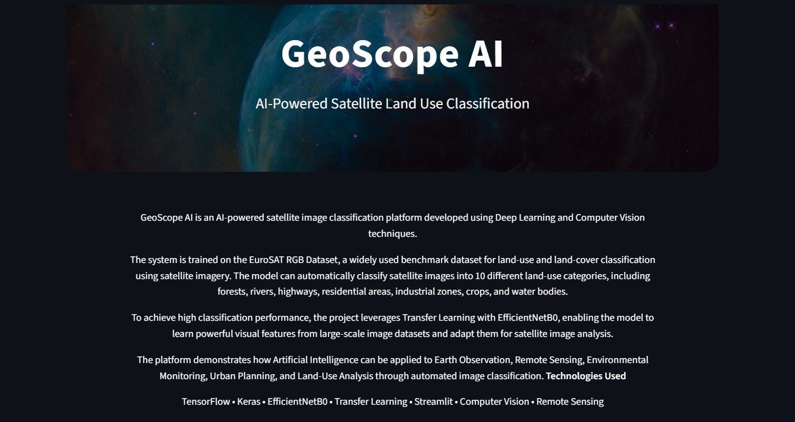
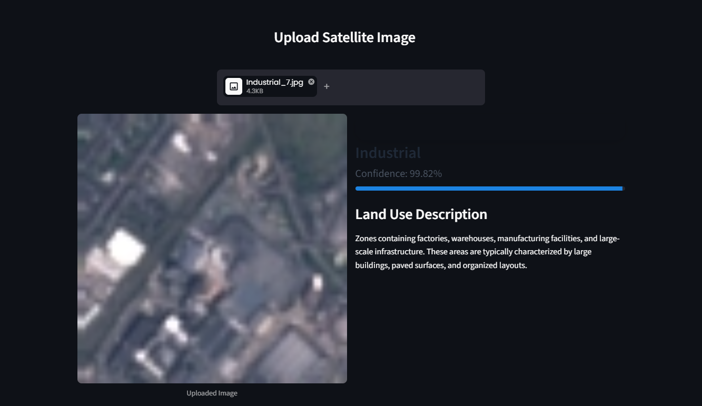
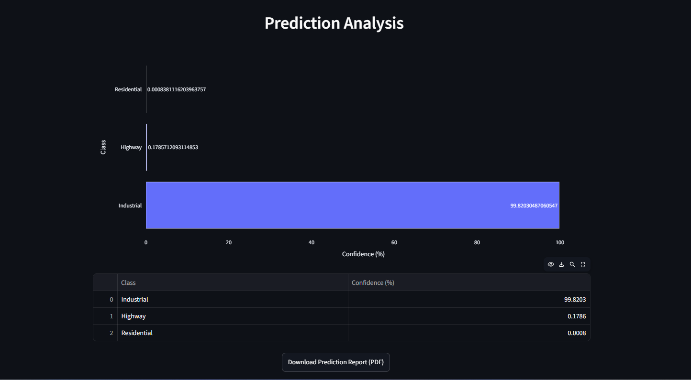

# GeoScope AI 🛰️

## AI-Powered Satellite Land Use Classification using Deep Learning

GeoScope AI is a Deep Learning-based satellite image classification system developed to automatically identify land-use and land-cover categories from satellite imagery.

The project utilizes Transfer Learning with EfficientNetB0 and is trained on the EuroSAT RGB Dataset to classify satellite images into 10 different land-use categories with high accuracy.

A Streamlit-based web application has been developed to provide real-time predictions, confidence scores, visual analytics, and downloadable prediction reports.

---

## Project Overview

Satellite image classification plays an important role in:

* Land Use Monitoring
* Urban Planning
* Environmental Analysis
* Agricultural Assessment
* Resource Management
* Remote Sensing Applications

GeoScope AI assists users by automatically analyzing satellite imagery and predicting the most likely land-use category using a trained Deep Learning model.

---

## Features

* Satellite Image Classification using Deep Learning
* EfficientNetB0 Transfer Learning Architecture
* EuroSAT RGB Dataset
* Real-Time Prediction Interface
* Confidence Score Visualization
* Top Prediction Analysis
* Downloadable PDF Prediction Reports
* Streamlit Web Application
* High Classification Accuracy

---

## Dataset

**Dataset:** EuroSAT RGB Dataset

**Source:** Kaggle

Dataset Link:

https://www.kaggle.com/datasets/waseemalastal/eurosat-rgb-dataset

### Dataset Statistics

| Parameter    | Value         |
| ------------ | ------------- |
| Total Images | 26,984        |
| Classes      | 10            |
| Image Size   | 224 × 224 × 3 |
| Color Mode   | RGB           |

### Land Use Categories

* AnnualCrop
* Forest
* HerbaceousVegetation
* Highway
* Industrial
* Pasture
* PermanentCrop
* Residential
* River
* SeaLake

---

## Model Performance

### Final Validation Results

| Metric              | Score  |
| ------------------- | ------ |
| Validation Accuracy | 95.57% |
| Validation Loss     | 0.1468 |

### Overall Performance

* Accuracy: 96%
* Macro Average F1 Score: 95%
* Weighted Average F1 Score: 96%

The model demonstrates strong performance across all land-use categories while maintaining excellent generalization on validation data.

---

## Technology Stack

### Deep Learning

* TensorFlow
* Keras
* EfficientNetB0
* Transfer Learning

### Data Processing

* NumPy
* Pandas
* Pillow

### Visualization

* Plotly

### Deployment

* Streamlit

### Reporting

* ReportLab

---

## Project Workflow

1. Data Collection
2. Data Preprocessing
3. Data Augmentation
4. Transfer Learning Setup
5. EfficientNetB0 Training
6. Model Evaluation
7. Prediction Generation
8. Streamlit Deployment
9. PDF Report Generation

---

## Live Demo

Deployment Link:

**[Add Streamlit Deployment URL Here]**

---

## Application Preview

### Home Page

### Prediction Result

### PDF Report

---

## Future Enhancements

Future improvements may include:

* Fine-Tuning Additional EfficientNet Layers
* Multi-Class Confidence Heatmaps
* Batch Image Classification
* Geospatial Metadata Integration
* Satellite Change Detection
* Land Cover Segmentation Models
* Cloud Deployment Optimization

---

## Author

Khushi Soni

GitHub:
https://github.com/Khushisoni702

LinkedIn:
https://www.linkedin.com/in/khushi-soni-90401b2a8

---

## License

This project is intended for educational, research, and demonstration purposes.
